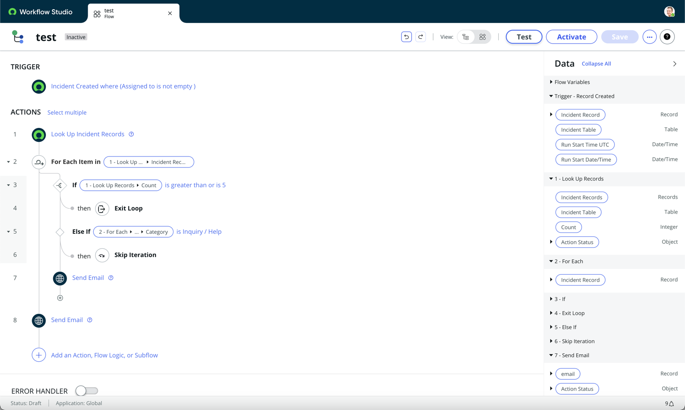

The ServiceNow Washington DC release introduces a couple of highly anticipated enhancements to Flow Designer, namely the Break and Continue functionalities within For loops. These seemingly minor yet robust additions prove to be instrumental in streamlining processes, eliminating the need for previously employed workarounds. In this article, we will delve into the practical applications of these features and explore how they can elevate your workflow experience.

# Introduction

In my day to day use of Flow Designer, I find myself using for loops quite often. Most of the time it's either looping through records within ServiceNow, or looping through objects from an API response. Occasionally, I will find the need to simply look for some piece of data, and then stop the for loop once found. Other times, I might need to skip over the entire iteration of a for loop, but proceed with the next one. These are both use cases for the new Break and Continue functionality in Flow Designer.

# Unveiling Break and Continue Features

In the realm of Flow Designer, the new functionalities that steal the spotlight are the Exit Loop and Skip Iteration features:

In a straightforward example, imagine a scenario where the flow is designed to retrieve all incidents assigned to a user and subsequently send an email for each incident. Leveraging the Exit Loop logic, we can efficiently terminate the loop if the incident count surpasses 5, opting for a more user-friendly approach by sending a consolidated email to prevent mailbox overload.

Similarly, if an incident falls under the category of Inquiry/Help, we can seamlessly skip the iteration, avoiding the generation of unnecessary emails. The versatility introduced by these features adds a layer of sophistication to your workflow.

# Real-world Applications

In the day-to-day utilization of Flow Designer, these functionalities prove invaluable. Whether navigating through ServiceNow records or handling objects from an API response, there are instances where the search for specific data necessitates a swift exit from the loop or the deliberate skipping of an iteration. Break and Continue are tailored to cater to precisely these use cases.

# Embracing the Future

The incorporation of these enhancements into Flow Designer marks a significant leap forward in terms of developer experience. These seemingly small features contribute to a more refined and efficient workflow, demonstrating ServiceNow's commitment to continually improving its platform. Excitement looms as we anticipate delving into other enhancements within Flow Designer introduced in the Washington DC release, promising an enriched developer journey that we will explore in upcoming articles. Stay tuned for more insights into the evolving landscape of ServiceNow!
