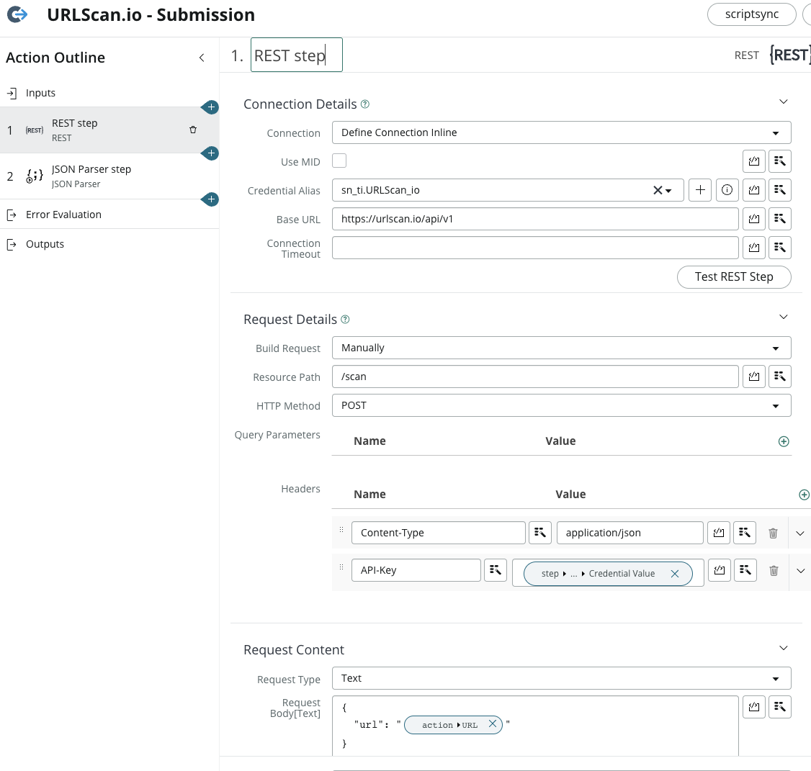

# Introduction

When Flow Designer was first released, I was working at and end-user. Many of my colleagues were skeptical, and there seemed to be some reluctance among developers to adopt the new product. This was completely understandable, as developers already had access to powerful tools such as Workflows, Business Rules, and Scheduled Jobs to name a few. Why would anyone be interested in yet another tool that achieves the same results, while also stepping away from building solutions with code? Personally, I felt that Flow Designer would never replace the need to write code in complex situations -- "Why would I even bother learning to use this tool? I'll just stick with what I know.", I told myself.

As I explored the capabilities of Flow Designer over the years, I realized that it offered a new level of flexibility and ease-of-use that traditional coding solutions simply could not match. In the end, I became a convert to the power of Flow Designer and its ability to streamline workflows and save valuable time and resources. Flow Designer allowed me to build complex workflows quickly, without the need to write and test long lines of code. This meant that I could focus on solving business problems and delivering results, rather than getting bogged down in the details of coding. Ultimately, I came to see Flow Designer not as a replacement for coding, but as a powerful tool that can work in harmony with traditional development methods.

As someone who is now employed by a ServiceNow partner, I have a vested interest in client satisfaction. It's why we do what we do - our goal should always be to leave the customer in a better shape than they were before the engagement started. To achieve this, it is important to understand the benefits of using Flow Designer and why ServiceNow developers should embrace it to produce business value and happy customers/stakeholders alike.

For those who are completely unfamiliar with Flow Designer, I will refer you to the [docs](https://docs.servicenow.com/bundle/utah-build-workflows/page/administer/flow-designer/concept/flow-designer.html) so that you can get a better understanding of the topics to follow.

# Benefits of Flow Designer

## Maintainability

One of the key benefits of Flow Designer is its maintainability. Traditional coding methods can be time-consuming and require extensive testing and debugging, but with Flow Designer, flows and subflows are built using a drag-and-drop interface. This means that changes can be made quickly and easily, without the need to modify code. This makes it much easier to maintain these objects over time, reducing the risk of errors and improving overall reliability.

Where this can really come into play is when you think through the eyes of a customer who has hired an implementation partner to configure their instance. It's not uncommon for the implementation partner to be in and out within a matter of months; the client has the ultimate responsibility for maintaining the partner's code. If that partner were to lean heavily on Flow Designer where possible, it would result in the client having a more digestable understanding of what was built, rather than needing to sloth through lines of code to pinpoint issues that may come up.

Flow designer objects are *readable* and *understandable* by non-technical stakeholders. If you need to walk through how a process works with a non-technical stakeholder, wouldn't it be much more pleasant to go through a Flow Designer diagram rather than 1000 lines of code? Flows, subflows, and actions are self-documenting in a way. Simply opening up a flow designer object and reading through the steps give a great high level overview of the process, especially if those steps are annotated (hint: they should be!).

#### Example

Consider the following use case: When the assignment group of an incident changes, update the assignment group of the problem to match, along with all other incidents related to the problem. From a customer perspective, which looks easier to understand and maintain? 😉

##### Option 1: Business Rule

The following after business rule could be used to achieve this when the incident's assignment group field changes:

```js
(function executeRule(current, previous /*null when async*/) {

	// Get problem record
	var problemId = current.problem_id;
	var problem = new GlideRecord('problem');
	problem.get(problemId);

	// Get current incident assignment group / assigned to
	var assignmentGroup = current.assignment_group.getValue();
	var assignedTo = current.assigned_to.getValue();

	// Update problem record assignment group / assigned to
	problem.assignment_group = assignmentGroup;
	problem.assigned_to = assignedTo;
	problem.update();

	// Update other incidents related to the problem
	var incident = new GlideRecord('incident');
	incident.addQuery('problem_id', problemId);
	incident.addQuery('sys_id', '!=', current);
	incident.query();

	while (incident.next()) {
		incident.assignment_group = assignmentGroup;
		incident.assigned_to = assignedTo;
		incident.update();
	}

})(current, previous);
```

##### Option 2: Flow Designer

The following flow could also be used to achieve this, triggering when the incident's assignment group field changes:


One can't deny that within seconds of looking at the flow designer diagram, it's easy to understand what is being done.

## Speed of Delivery

Perhaps the most significant benefit of using Flow Designer is the faster delivery time it enables. Traditional coding methods can take weeks or even months to build and test complex solutions, but with Flow Designer, solutions can be created and tested in a matter of hours or days. This means that businesses can respond to changing needs and requirements much more quickly, improving agility and reducing the time to market for new products and services. Additionally, because of this benefit, the development team will have extra bandwidth to focus on more critical issues.

As someone with a more traditional development background who LOVES to write code, it was a struggle to accept Flow Designer as the new path forward. I didn't want to give up the option to code in favor of some drag-and-drop tool. But having used it extensively over the past 2 years, I found that Flow Designer is not meant to replace the need to code, but rather to supplement my set of tools. It relieves you of the tedium in writing code. Need to parse some JSON? Throw it in the JSON Parser action step. Need to run a GlideRecord query or update some records? Just use the OOB actions for this. When I DO need to write code (which I still do daily) it's much more rewarding because it's more of the actual problem-solving type of coding rather than the boring and tedious GlideRecord update I've written hundreds of times before.

Because Flow Designer handles these common tasks with ease, it allows us to focus on the real problems at hand. And in turn, we are left with a much more rapid development process, and a faster production of value for stakeholders.

#### Example: Integrations

One great way to showcase the "Speed of Delivery" benefit is with integrations. With Integration Hub we get many pre-built integrations that allow us to quickly drag and drop integration use cases into flows/subflows. What's more, if a custom integration is needed, it's so quick to set up in Flow Designer. Where we could have used custom REST messages and the RESTMessageV2 API in a script include or scheduled job in the past, we can now build all within Flow Designer.

It's super fast to build a Flow Designer action (which by the way has native support for stored Credentials) for each REST endpoint needed, and then throw them all together in a subflow to immediately start orchestrating.

Here is an example of a simple integration with URLscan.io which was built in ~15 minutes to pull in threat lookup results for an observable, a common use-case in Security Operations.

##### The Flow

The flow will be triggered when an observable is created, and the type is URL, Domain name, or URI. The flow simply kicks off a subflow which contains the integration logic.


##### The Subflow

The subflow calls some custom actions that were built - one which submits the URL to URLscan.io, and another which pulls the results of the submission. Once the results are returned, a threat lookup record is created and associated with the observable.


##### The Actions

These 2 actions perform simple REST calls to submit a URL to URLscan.io, and then retrieve the results. After the REST step, the JSON Parser step is used to convert the results into an object, which can then be mapped to the outputs of the actions.




##### The Results

The end result of this integration is to store some details about the URL in a threat lookup record. Here are the results of submitting my own website to URLscan.io:


Of course, more time could have been spent on mapping data into the appropriate fields, but to demonstrate the ease and speed of integrating using Flow Designer, it was kept simple. Within 15 minutes, I have URLscan.io data coming into ServiceNow!

PS: Stay tuned for a URLscan.io integration deep-dive post in the near future!

## Reusability

Another major advantage of Flow Designer is the ability to create reusable components. This means that once you've built a component, whether it's a subflow or a flow action, you can reuse it in other flows/subflows and even share it with other teams. This saves time and effort in building new Flow Designer components from scratch, and it also promotes consistency and standardization across the organization. Reusable components can be thought of as building blocks, where a focus on modularity and reusability will save a lot of time and effort.

How many times have you built a business rule for one table, and realized you need the same logic to be applied on another table? You could always just copy the business rule and change the table it affects, but then you have 2 sets of code to maintain. To improve upon that, you could refactor the common logic of those business rules into a script include and call that. That's fine and well, but if the logic is complex, it would be critical that the script include is well-documented. An alternative would be to build a subflow in Flow Designer, that is then called by flows triggered from each table. You can achieve the same effect, while gaining the aspects of maintainability and development speed.

# Closing Thoughts

In closing, Flow Designer is a powerful tool that offers a wide range of benefits to ServiceNow developers and organizations. By leveraging its drag-and-drop interface, developers can build solutions quickly and easily, improving agility and reducing time to delivery. Additionally, the ability to create reusable components promotes consistency and standardization, making it easier to maintain and update solutions over time. However, it is important to use Flow Designer wisely, and to be aware of its limitations and potential pitfalls. With the right approach, Flow Designer can be an invaluable tool for delivering business value and satisfying customers and stakeholders. We as developers should continue to embrace this amazing tool and see its near-endless uses.