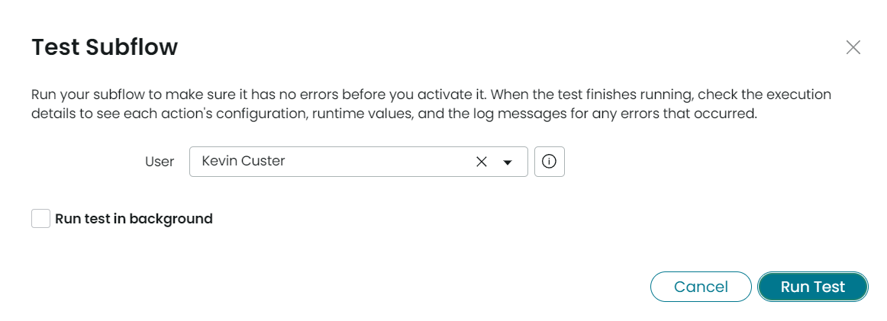

Wouldn't it be nice to have a Flow Designer action that will let you send Connect Chat messages to users within flows? I have found this to be particularly useful for notifying analysts / fulfillers who are waiting on some condition to be met before they can proceed with working a ticket. With connect chat messages, analysts can be notified once something is finished while they work through other tasks, without being bombarded with email or SMS notifications. In this article, we will build a single Flow Designer action that can both create conversations and send messages to existing conversations.  We will then use that action in an example flow.

> **Note**: You will need the Connect plugins activated in your instance (com.glide.connect.*)

# Build Connect Chat Flow Action

We will be building a flow action that can both start a conversation, or add messages to an existing conversation.  This way, there is only one flow action to work with when building flows.  We will also be using the [Conversation API](https://developer.servicenow.com/dev.do#!/reference/api/rome/server/sn_connect-namespace/c_ConversationScopedAPI) to start and send messages to conversations.

Let's begin by creating a new Flow Designer action, named `Connect Chat - Send Message`.

## Inputs

In the inputs section of the flow action, we will need a few things:

| Label               | Name                | Type           | Purpose          |
|---------------------|---------------------|----------------|------------------|
| User                | user                | Reference.User | Add user to a conversation, used only when creating a conversation |
| Subject             | subject             | String         | Set the subject of a conversation, used only when creating a conversation |
| Body                | body                | String         | The message to send to the conversation, used in both new and existing conversations |
| Conversation Sys ID | conversation_sys_id | String         | The conversation's Sys ID, used only when sending a message to an existing conversation |

The inputs screen should appear as follows after setting these up:


## Outputs

We will also need the following outputs:

| Label               | Name                | Type           | Purpose          |
|---------------------|---------------------|----------------|------------------|
| Conversation Sys ID | conversation_sys_id | String         | The conversation's Sys ID, used in output to chain together multiple messages in a single conversation |
| Error Message       | error_message       | String         | Return any errors caught during execution |

The outputs screen should appear as follows after setting these up:


## Script Step

Next, we will insert a **Script Step** into the action, and name it `Send Message`.

We'll set up the following input and output variables for the script step, and map them to the corresponding action inputs / outputs:


### Connect Chat Script

Finally, we can get to the meat of the action where we will work with the Conversation API to send messages to users.  Add the following script in the Script editor:

```js
(function execute(inputs, outputs) {
  if (inputs.conversation == '') { // no Conversation Sys ID passed, start a new conversation
    try {
      
      // 1. Create the Conversation
      var conversation = sn_connect.Conversation.create({
        name: inputs.subject,
        type: "connect"
      });
      
      // 2. Add the provided user to the conversation as a subscriber
      conversation.addSubscriber(inputs.user.getValue('sys_id'));
      
      // 3. Send the message
      conversation.sendMessage({
        body: inputs.body
      });
      
      // 4. Get the new conversation's Sys ID
      outputs.conversation = getConversation(inputs.subject);
      
    } catch (err) {
      outputs.error_message = err;
    }
  }
  else { // Conversation Sys ID passed, add message to existing conversation
    try {
      
      // 1. Get the conversation by provided Sys ID
      var conversation = sn_connect.Conversation.get(inputs.conversation);
      
      // 2. Send the message
      conversation.sendMessage({
        body: inputs.body
      });

    } catch (err) {
      outputs.error_message = err;
    }
  }

  // Since the Conversation API does not provide a GlideRecord object or Sys ID,
  // look up the most recently created conversation by subject and return the Sys ID
  function getConversation(subject) {
    var conversationId;
    var grConvo = new GlideRecord('live_group_profile');
    grConvo.addQuery('name', 'CONTAINS', subject);
    grConvo.orderByDesc('sys_created_on');
    grConvo.query();
    
    if (grConvo.next()) {
      conversationId = grConvo.getValue('sys_id');
    }
    
    return conversationId;
  }
})(inputs, outputs);
```

The code above should be documented well enough to understand, but it should be called out that creating a new conversation via the `sn_connect.Conversation.create` function does not return a GlideRecord object or Sys ID.  This is why we need to look up the most recently created Conversation once the conversation is created.

# Test Connect Chat Flow Action

## Build a Testing Subflow

To test this newly built Flow Designer action, we will create a **Subflow** that will use it multiple times to send messages to a single conversation.

First, we will create a new Subflow named **Test Connect Chat Action**

The testing subflow will accept a sys_user reference as an input, and we won't need any outputs:


Next, we will add 2 instances of the **Connect Chat - Send Message** action to the subflow.

In the first action, we will specify the **User**, **Subject**, and **Body** arguments:


Then, in the second instances of the **Connect Chat - Send Message** action, we only need to provide the **Conversation Sys ID** (found in the outputs of the first call to the action), as well as the **Body**:


Finally, we can optionally add a short wait between the 2 messages.  The overall steps of the testing subflow should look like this when finished:


## Run the test!

When clicking the **Test** button on the subflow, we will be asked to provide a user. Choose the current logged in user, and then click **Run**:



When we navigate back to the Platform UI tab, we will see 2 messages delivered via connect chat:


We now have a reusable action for sending Connect Chat notifications to users via Flow Designer!


# Update Set

[Click here](https://github.com/odinsride/sn-update-sets/blob/main/Flow%20Designer%20-%20Connect%20Chat%20Action.xml) to download the update set containing everything we built in this article!