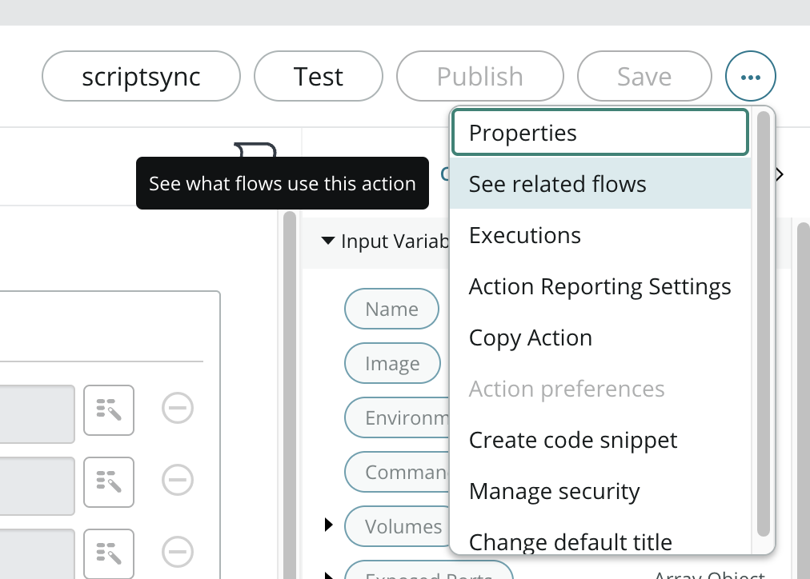
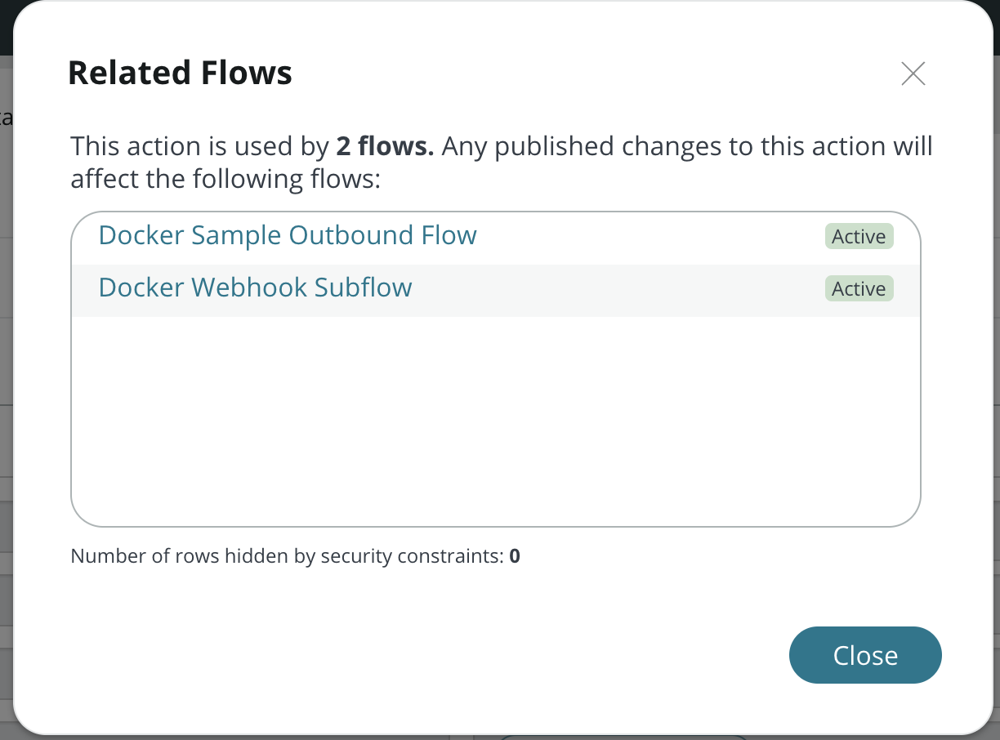
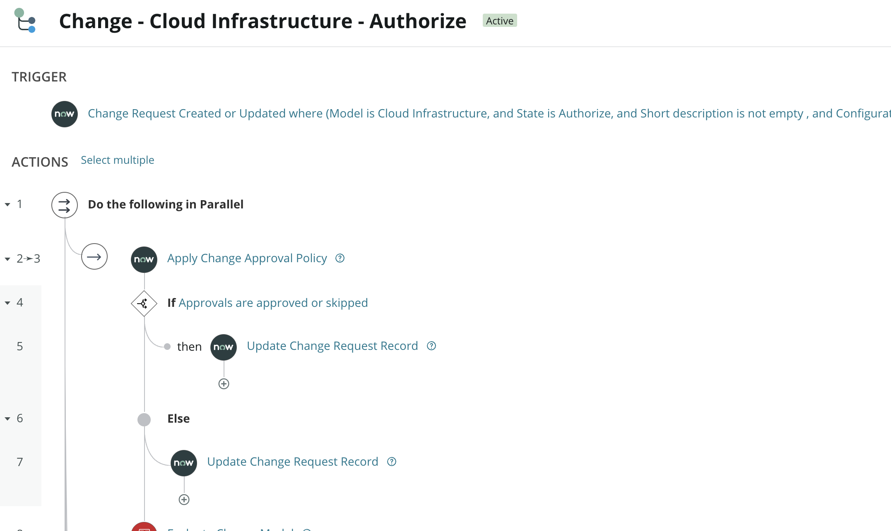
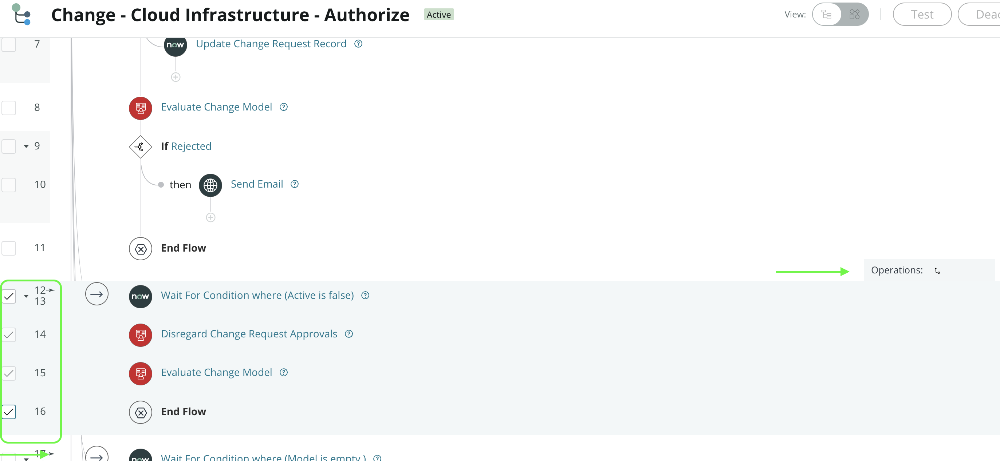
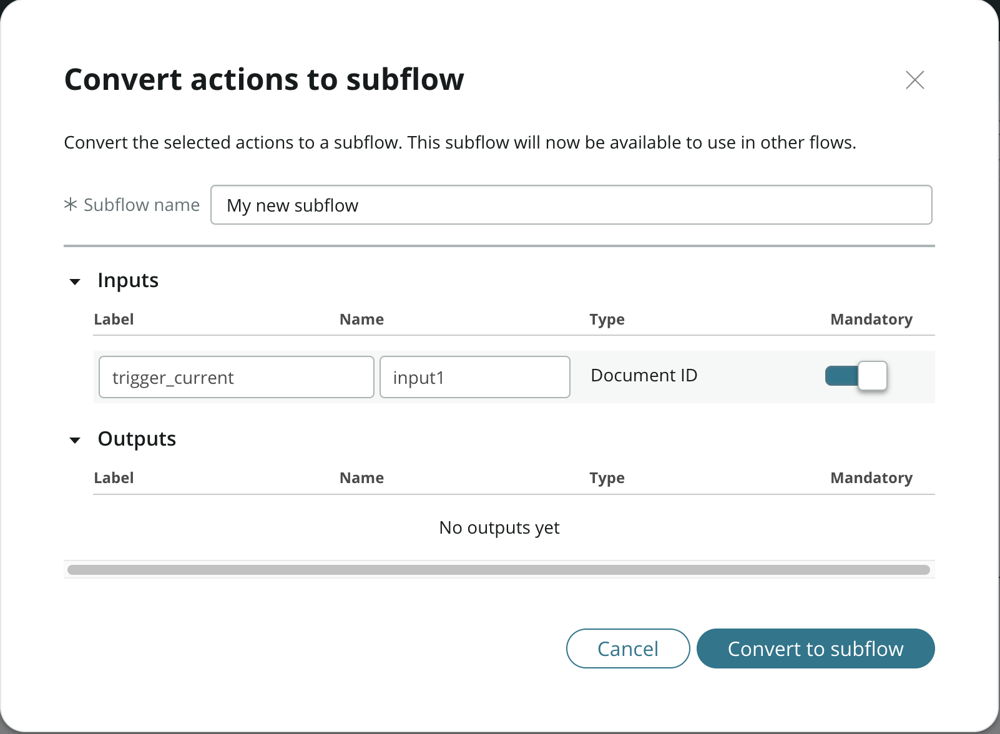
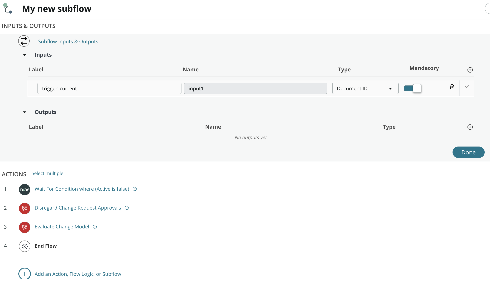
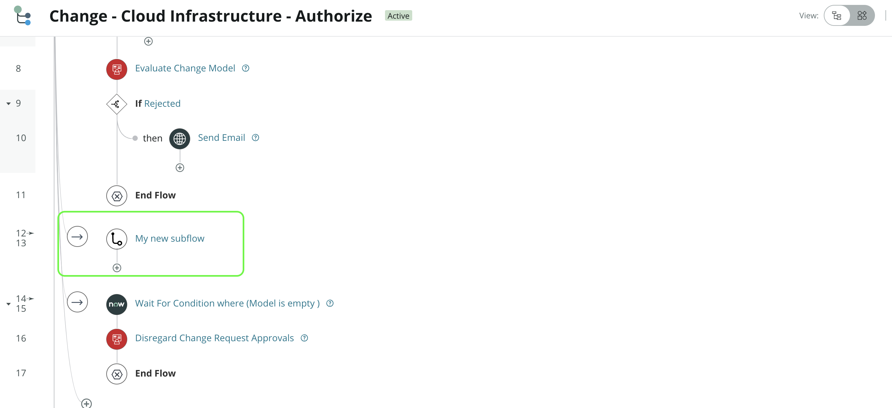

With the Utah release of ServiceNow, some nice quality of life improvements for Flow Designer have been added. We now have the ability to see all the places subflows and actions are used, create subflows from consecutive steps, and much more! In this post I'll cover some of the new Flow Designer features Utah has to offer!

# Related Flows for an Action / Subflow

Have you ever wanted to know all the places your subflow and/or custom action is being called? It could be done previously via table queries, but with Utah, there's a nice feature to see this built right into Flow Designer. Here's how to use it:

1. Navigate to a subflow or action
 
2. Click the "..." in the right hand corner, and then **See related flows**  

  
3. A dialog will pop up which shows all the flows in the system using the subflow or action. Neat!  

# Create Subflow from Consecutive Steps

Another great new feature for Flow Designer in ServiceNow Utah is the ability to create subflows by selecting a group of consecutive steps/actions. This can be handy if you're building a flow and decide some portion of that flow may actually be reusable, and better suited for a subflow. Here's how to do it:

1. In your flow, click the **Select multiple** link right next to the Actions header  

  
2. Select the steps you want to convert into a subflow (they must be consecutive), and then click the **Operations** link  

  
3. You will be presented with a dialog to convert the actions to a new subflow from your selection. You can enter a name for the new subflow, and add inputs as needed.  

  
4. Clicking the **Convert to subflow** button does 2 things: First, it creates a new subflow using the actions you selected. Then, it *also* replaces those actions in the original flow, with the newly created subflow. Pretty cool!  

  

# Conclusion

These are only a couple of the new features for Flow Designer in the Utah release. There are many more updates for us FD junkies, including some new FlowAPI functions, stages support in flow diagramming, and flow priority settings.  Check out the full release notes for Flow Designer **[here](https://docs.servicenow.com/bundle/utah-tokyo-df3/page/release-notes/rn-combined/utah-tokyo/utah-tokyo-flowdesigner-release-notes.html)**. Thanks for reading!
