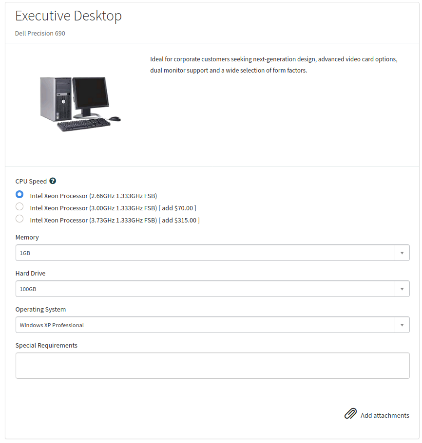
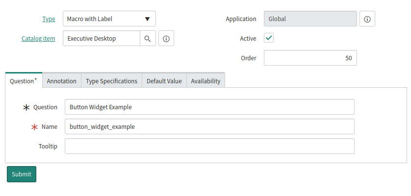
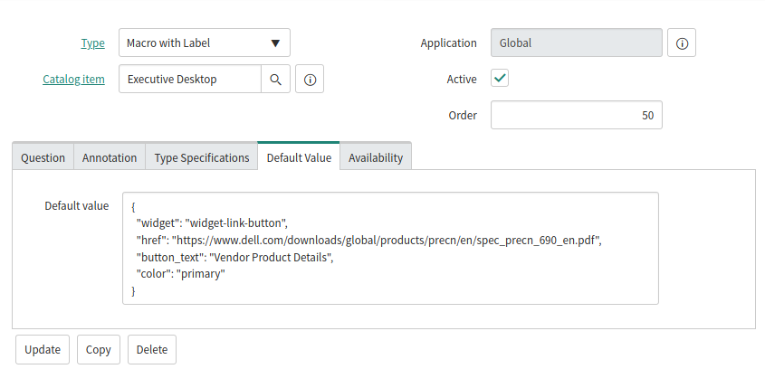
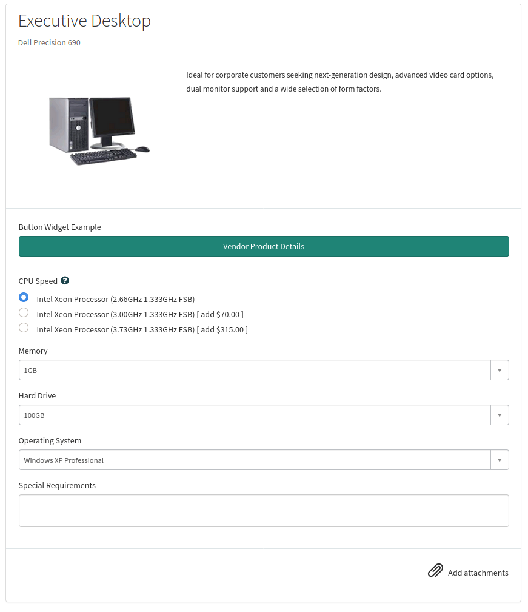

## Intro

In my current role, the need has come up to do some pretty complex things on Service Catalog Items running on Service Portal.  Service Portal widgets are useful for building and containing complex pieces of business or presentation logic, but typically they aren't used within the context of a Catalog Item.  However, you may end up wanting to allow the user to maybe create some data via modal popup form, or view an image carousel while on a service request form... you know, fancy stuff like that.

It's possible to do this by using the **Default Value** field of a Service Catalog Item Variable, and you can also pass in instance options in this manner.  For example, you might want to render a Button widget in the catalog item that does something or navigates to an external URL. Now, you probably don't want to create a Button widget every time you do this, so you can create a generic Button widget that accepts a URL and label as **instance options**.  Let me demonstrate...

## The Catalog Item

We'll be using out of the box objects for this demonstration, and there is a catalog item named **Executive Desktop** that we will use. Let's take a look at the stock catalog item form:



Nothing fancy about this. Let's add a Button to the form that directs users to the vendor's product details page as the goal for this demo.

## The Widget

ServiceNow ships with a Button widget out of the box named **link-widget**, so we will use that.  This widget has an option schema that accepts the following instance options:

* **href** - The URL to link to when clicking the button
* **button_text** - The text to be displayed on the button

## Add the Widget to the Catalog Item

Open the **Executive Desktop** catalog item, and create a new **Variable** with the following settings:

| Field | Value |
|-------|-------|
| **Type**  | Macro with Label |
| **Order** | 50 |
| **Question** | Button Widget Example |
| **Name** | button_widget_example |


> **Note**: By default, the Question field is mandatory on pretty much all variables, but you probably don't want to show this when displaying a widget on a catalog form.  In this case, you can turn off the UI policy for variable type **Macro with Label** so the Question field is not mandatory.  For this demo however, we will leave it enabled.

The variable form should look like this:




Now click on the **Default Value** tab, and enter the following:

```json
{
  "widget": "widget-link-button",
  "href": "https://www.dell.com/downloads/global/products/precn/en/spec_precn_690_en.pdf",
  "button_text": "Vendor Product Details",
  "color": "primary"
}
```

This JSON string is telling the variable to render the **widget** by ID, and passing in the instance options for **href** and **button_text**.  Additionally we are passing the hidden instance option **color** to make the button use the theme's primary color.



Click **Submit**, and we're ready to test!

## Did it Work?

Refresh the Catalog Item Form on your Service Portal and see if the button widget is displayed.  It should look like this if everything went as planned:



Looks like everything worked! You can see that the button is rendered using the **button_text** we passed in, and should navigate to the URL of the **href** option we passed in.  You can also see that the variable's **Question** text is being displayed above the button, however this can be made non-mandatory with a UI Policy change.  

Using this approach, the possibilities are endless when designing catalog item forms. Now go impress your manager! :)